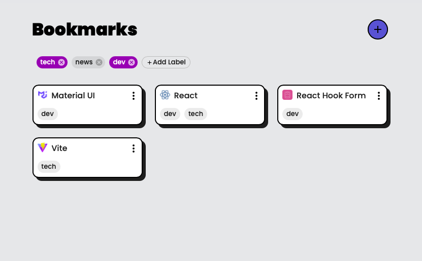

# React Bookmark Manager

Bookmark manager that allows you to tag multiple labels. Once you create new labels by clicking the "Add Label" button, you can select the labels when adding a bookmark.  

**Live Demo: https://simicity.github.io/bookmark-manager/**

## Key Tools Used
- [React](https://react.dev/)
- [React Hook Form](https://react-hook-form.com/)
- [Redux](https://redux.js.org/)
- [Material UI](https://mui.com/)
